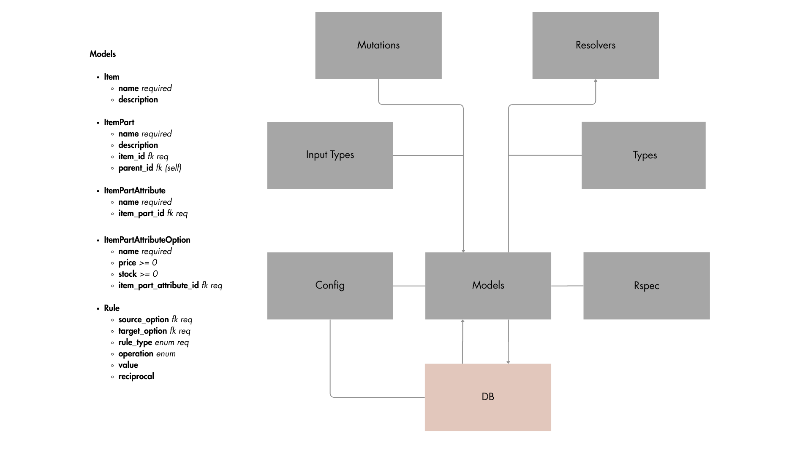

# 🔙 Backend

Built with Ruby on Rails and GraphQL.

**Components**:
- Models
- Types
- Resolvers
- Mutations
- Tests (RSpec + FactoryBot)

**Basic Setup**:
- Enable CORS for React (port `5173`)
- GraphQL 2.5 minimal configuration
- Additional Gems: `rspec-rails`, `factory_bot_rails`

**Architecture**:
- `Item`: retrieves top-level parts (`parent_id` is null)
- `ItemPart`: retrieves its own child parts (recursive tree)
- `ItemPartAttribute`: standard ActiveRecord model
- `AttributeOption`:
  - Retrieves rules where option is **source** or **target**
  - Avoids front-end complexity when handling option relations
- `Rule`: validates logic depending on rule type

#### GraphQL Patterns

- `Create`: expects full parameters + parent component ID
- `Update`: uses component ID + parameters
- `Delete`: only needs the ID

#### Encapsulated vs Separated Inputs

- Most mutations use separated parameters
- AttributeOption `create/update` use encapsulated input due to multiple related params

#### Option Manages Rules

- Rules are handled within `Option` mutations
- Updating an option:
  - Deletes rules where option is **source**
  - Deletes **reciprocal** rules where option is **target**
  - New rules are created based on input

### 🌳 Backend Architecture

